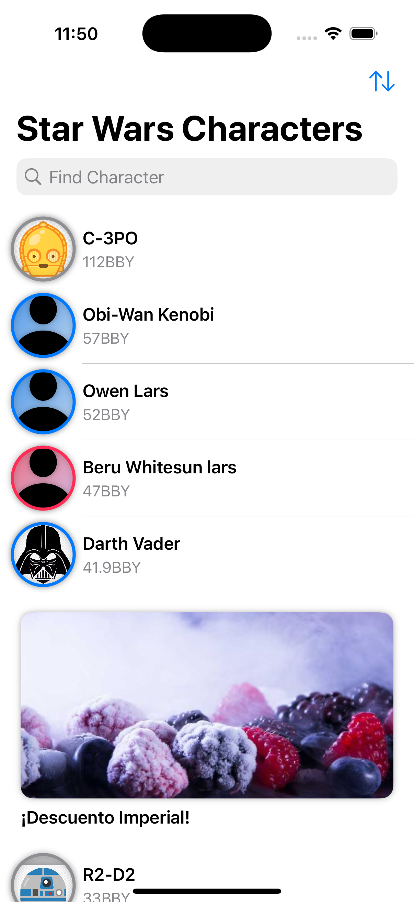
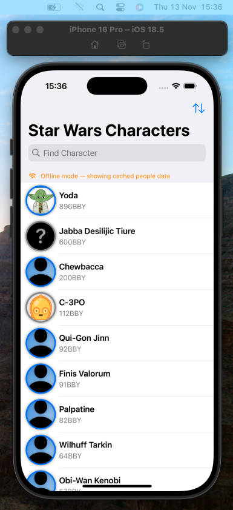
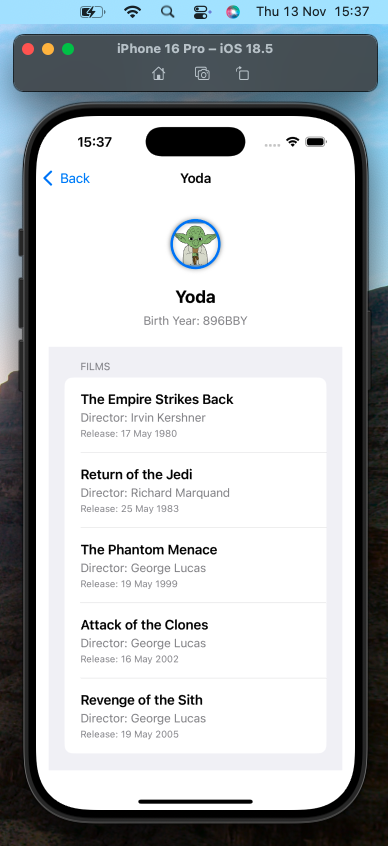
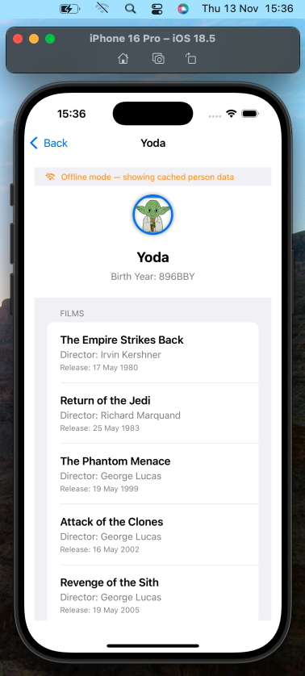
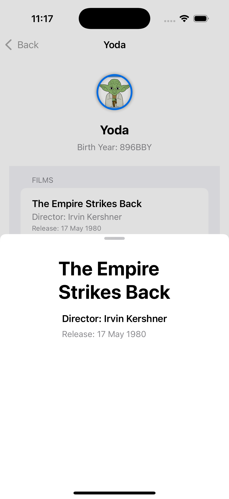
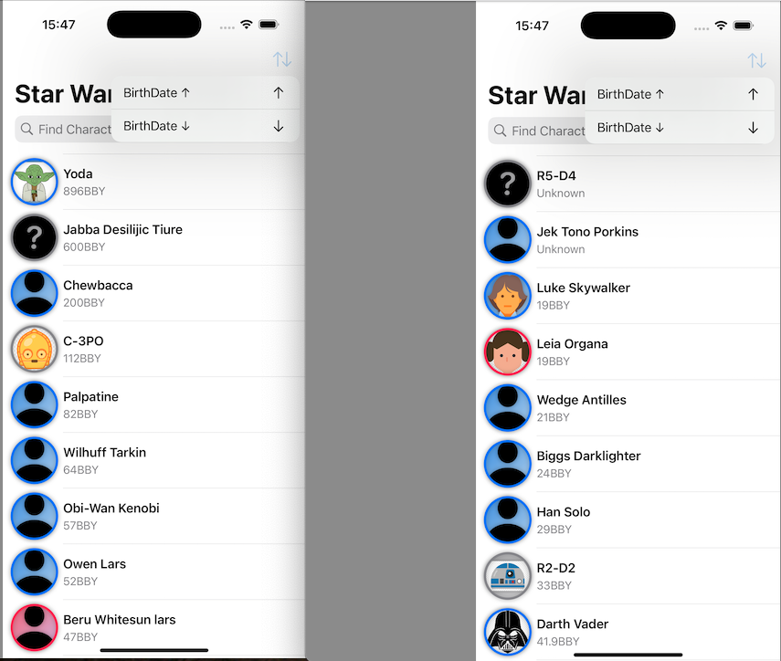
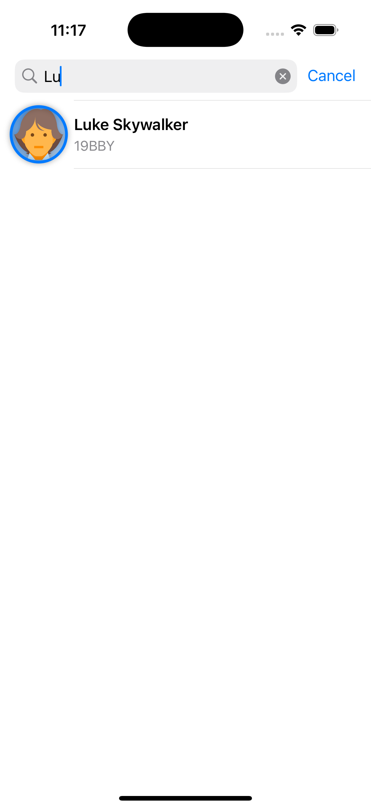
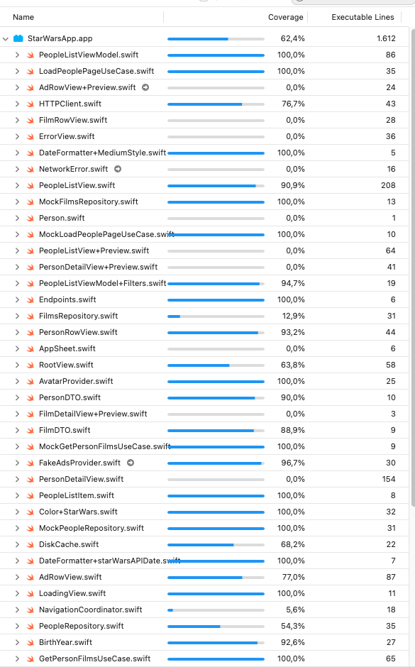

# StarWars Explorer + Ads (Swift / MVVM / Clean Architecture)

## SWAPI (The Star Wars API) 

Fuente: [https://swapi.dev/](https://swapi.dev/) 
Documentación: [https://swapi.dev/documentation](https://swapi.dev/documentation) 

Este proyecto es una aplicación iOS desarrollada en **Swift 6** utilizando **SwiftUI**, arquitectura **MVVM**, concurrencia nativa (`async/await`) y principios de **Clean Architecture**.

La app consume la API pública **SWAPI** y permite visualizar personajes, su información y las películas en las que aparecen.

---

## Estructura del proyecto 

<table border="3" bordercolor="black" align="center">
    <tr>
        <th colspan="3">UI display in iPhone 16 Pro</th> 
    </tr>
    <tr>
        <td></td>
        <td></td>
        <td></td>      
    </tr>
    <tr>
        <td></td>
        <td></td>
        <td></td>      
    </tr>
    <tr>
        <td></td>
        <td></td>
        <td></td>
    </tr>
      
</table>

###  1. Listado de todos los personajes con paginación tipo *endless*

La aplicación carga todos los personajes de SWAPI usando paginación manual, sin librerías externas, y muestra en el listado exactamente la información solicitada.

**Identificación visual del tipo de género (implementación real):**
- Para algunos personajes se añadieron avatares personalizados en los assets.
- Para el resto, la app genera dinámicamente un avatar utilizando **SF Symbols (versión beta)**.
- El avatar muestra un **borde y color dinámico según el género**:
  - **Blue** → género masculino  
  - **Pink** → género femenino  
  - **Gray** → género desconocido o no especificado  

Además, el listado muestra:
- Nombre del personaje  
- Fecha de nacimiento (`BirthYear` formateado)  

Y toda la paginación funciona al estilo *endless scroll*, gestionada desde `PeopleListViewModel`.

---

###  2. Detalle del personaje mostrando películas ordenadas por fecha de estreno
Al pulsar sobre un personaje, la aplicación:
- Navega a `PersonDetailView`.
- Carga las películas asociadas mediante `GetPersonFilmsUseCase`, utilizando concurrencia con `TaskGroup`.
- Ordena las películas **cronológicamente por fecha de estreno**, tal como exige el enunciado.

**Cada película muestra:**
- Nombre de la película.
- Director.
- Fecha de estreno.

---

###  3. Funcionamiento sin conexión con los últimos datos cargados
El proyecto implementa un modo **offline** mediante el mecanismo de caché local del repositorio:

- `CachedResponse` informa si los datos provienen del caché.
- Si la API falla, la app sigue funcionando con los datos descargados previamente.
- La UI muestra `isOfflineMode = true` cuando se está utilizando información local.
- Los ViewModels están preparados para mostrar datos almacenados si no hay red.

Esto garantiza que la aplicación cumple el requisito de:

> “La app debe funcionar sin conexión a internet con los últimos datos cargados para que los miembros del equipo puedan acceder a la información en cualquier circunstancia.”

---

## 4. Inserción de anuncios en el listado de personajes

El equipo quiere monetizar la app mostrando un anuncio **cada X personajes**, usando un **SDK interno** que se debe invocar de forma explícita.

### Integrar anuncios manteniendo:
- Clean Architecture  
- Testabilidad  
- Separación de capas  
- Independencia de la UI respecto al SDK  

---

#### **Anuncios en la lista de personajes**
- Crear un `AdsProviderProtocol` como capa de abstracción del SDK interno de anuncios.
- Modificar el ViewModel para exponer una lista heterogénea `PeopleListItem` (persona o anuncio).
- Insertar un anuncio cada *X* personajes en la capa de presentación, manteniendo el código desacoplado, testeable y siguiendo MVVM + Clean Architecture.

---

### Resultado

Todos los requerimientos del proyecto han sido implementados siguiendo las buenas prácticas:

- Arquitectura MVVM + Use Cases + Repositories  
- Concurrencia moderna (`async/await`, `TaskGroup`)  
- SwiftUI para toda la interfaz  
- Caché local para modo offline  
- Paginación personalizada sin librerías  
- Tests unitarios completos para ViewModels y Use Cases  
    

## Autora

Grace Toapanta
Desarrolladora iOS – SwiftUI/UIKit
📧 gracetoa29@gmail.com

💼 LinkedIn
https://www.linkedin.com/in/grace-toa/

Repositorios
https://github.com/GraceToa

